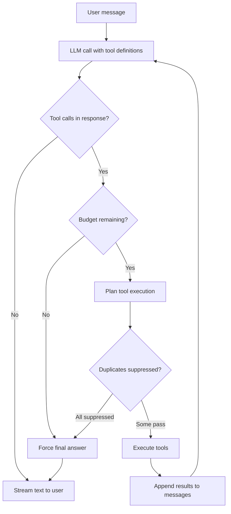
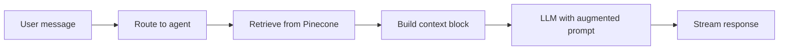

# Chat Modes

AgenticRAG has two distinct chat paths, each designed for a different interaction pattern.

## General Chat

The user talks to an orchestrator that can autonomously call tools — web search, database queries, headless browsing, knowledge base lookups — across multiple reasoning steps.

### Orchestration Loop

The loop in `api/chat.py` works as follows:

1. The user message is appended to the session's message history
2. The LLM is called with the full message history and tool definitions
3. If the response contains tool calls, the **tool planner** decides which to execute
4. Tool results are appended as messages, and the LLM is called again
5. This repeats until the LLM responds with text (no tool calls) or a budget is hit

### Budget Constraints

| Budget | Limit | What happens when exceeded |
|--------|-------|---------------------------|
| Reasoning steps | 3 | A system message instructs the LLM to stop using tools and answer with gathered evidence |
| Total tool calls | 6 | Same forced final answer |
| Parallel calls per step | 3 | Extra calls are deferred to the next step |

When budget is exhausted, `_force_final_answer()` injects a system message and calls the LLM without tool definitions. If the LLM still returns tool calls or empty content, a stricter instruction is injected. If that also fails, a graceful fallback message is returned.

### Tool Planner

The tool planner (`utils/tool_planner.py`) sits between the LLM's requested tool calls and actual execution. It decides:

- **Parallel vs sequential:** Tools marked `parallel_safe` with `requires_fresh_input=False` run concurrently. All others run one at a time.
- **Duplicate suppression:** Each tool call is fingerprinted (SHA-256 of name + key arguments). If the same fingerprint was already executed and no new tool evidence has arrived since, the call is suppressed.
- **Batch limits:** The number of parallel calls is capped by `max_parallel_calls_per_step` and each tool's `max_parallel_instances`.

This prevents common LLM failure modes: calling the same search twice, running out of budget on redundant calls, or executing tools that need sequential results in parallel.

### Conversation Summarization

When prompt tokens exceed 5,000, older messages are summarized to keep the context window manageable. The summarizer (`utils/summarizer.py`):

1. Splits messages into "old" and "recent" (keeping the last 4 non-tool messages)
2. Sends old messages to the LLM with a summarization prompt
3. Replaces old messages with a single `[Previous conversation summary]` message

The split point is adjusted to avoid cutting in the middle of a tool call/response pair.

## Project Chat

The user uploads documents to a project and chats with them. Instead of tools, this mode uses agent routing and RAG retrieval.

### Pipeline

The flow in `api/project_chat.py`:

1. **Agent routing** — the router classifies user intent and selects a specialized agent (reasoning, summary, quiz, visualization). The agent's system prompt replaces the default in the message history.
2. **Retrieval** — the user's query is embedded and matched against the project's Pinecone index. Agent-specific overrides can change `top_k` and hybrid search `alpha`.
3. **Context injection** — retrieved chunks are formatted into a context block and appended to the user message. The context is ephemeral — only the raw user text is persisted.
4. **Streaming** — the LLM generates a response grounded in the retrieved context. No tools are available.

### Summarization Thresholds

Project chat has higher thresholds than general chat because RAG context blocks inflate token counts:

| Trigger | Threshold |
|---------|-----------|
| Prompt tokens | 10,000 |
| Message count | 18 (fallback when token usage is unavailable) |

### SSE Event Types

Both chat modes stream Server-Sent Events to the frontend:

| Event | Data | When |
|-------|------|------|
| `token` | Text chunk | Each streamed token |
| `tool` | `{"name": "...", "args": {...}}` | Tool call started (general only) |
| `thinking` | `{"content": "..."}` | Reasoning step or result summary |
| `agent` | `{"name": "...", "description": "..."}` | Agent selected (project only) |
| `retrieval` | `{"sources": [...], "count": N}` | Sources found (project only) |
| `error` | Error message | Something went wrong |
| `done` | `{"tools_used": [...], "prompt_tokens": N}` | Turn complete |

### Session Lifecycle

Both modes share the same session infrastructure:

1. **Creation** — a 12-character hex session ID is generated. The system prompt (with user memory injected) and user ownership key are stored in Redis with a 24-hour TTL.
2. **Messages** — stored as a JSON array in Redis during the conversation. Saved to PostgreSQL by the frontend after each turn.
3. **Restore** — when a user reopens a past session, messages are loaded from PostgreSQL and the Redis session is recreated with a fresh system prompt.
4. **Memory extraction** — after each turn, an ARQ job is enqueued to extract and persist user memories from the conversation.
