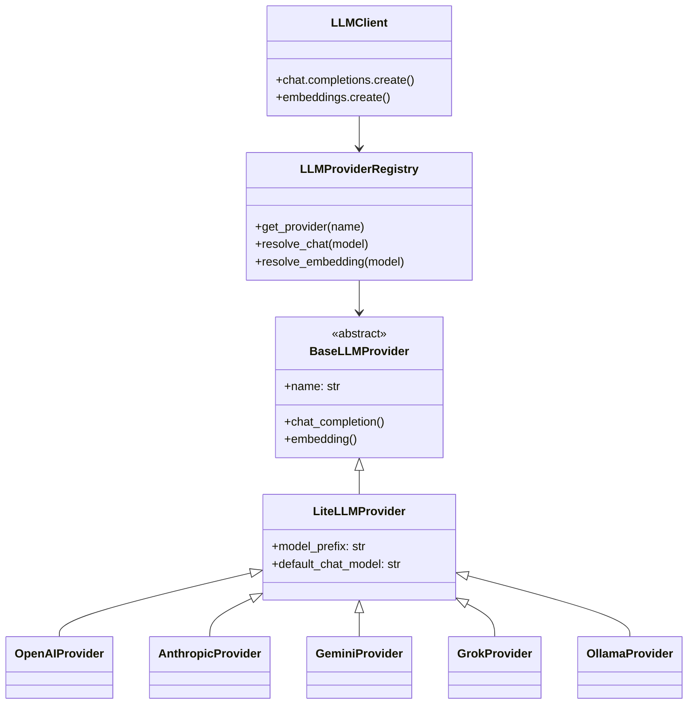

# LLM Layer

## Why an Abstraction Layer?

The application supports five LLM providers (OpenAI, Anthropic, Gemini, Grok, Ollama) through a single interface. The abstraction exists for three reasons:

1. **No vendor lock-in.** Switching the default model from GPT to Claude is a one-line config change, not a codebase refactor.
2. **Per-call model selection.** Different operations can use different providers — a fast model for agent routing, a capable model for reasoning, a cheap model for summarization.
3. **Unified instrumentation.** Every LLM call — regardless of provider — gets the same observability: TTFT tracking, token counting, cost estimation, and OpenTelemetry spans.

## Architecture



### Components

| Component | File | Purpose |
|-----------|------|---------|
| `BaseLLMProvider` | `llm/base.py` | Abstract base class defining `chat_completion()` and `embedding()` |
| `LiteLLMProvider` | `llm/providers/litellm_provider.py` | Shared implementation that delegates to LiteLLM with model name normalization |
| Concrete providers | `llm/providers/*.py` | Provider-specific subclasses (model prefixes, defaults, extra kwargs) |
| `LLMProviderRegistry` | `llm/factory.py` | Singleton that instantiates providers and resolves models |
| `LLMClient` | `llm/client.py` | OpenAI-compatible facade (`client.chat.completions.create(...)`) with instrumentation |

## Model Resolution

When you call `llm_client.chat.completions.create(model="claude-sonnet-4-20250514")`, the resolution works in two steps:

### Step 1: Provider Detection

If the model string contains a `/`, the prefix is treated as an explicit provider:

```
openai/gpt-4o-mini  →  provider="openai", model="gpt-4o-mini"
anthropic/claude-3  →  provider="anthropic", model="claude-3"
```

If no `/`, the model name is matched against inference rules:

| Pattern | Inferred provider |
|---------|------------------|
| `claude*` | anthropic |
| `gemini*` | gemini |
| `grok*` | grok |
| `text-embedding-004*` | gemini |
| `text-embedding-*` | openai |
| Contains `:` or starts with `llama`, `mistral`, `qwen`, `phi`, `gemma`, `deepseek` | ollama |
| Everything else | openai |

### Step 2: Model Name Normalization

The `LiteLLMProvider` base class adds the provider prefix for LiteLLM's routing format (`openai/gpt-4o-mini`). It also handles cross-provider fallbacks — if a non-OpenAI provider receives an OpenAI model name like `gpt-4o`, it substitutes its own default model instead of failing.

Provider aliases allow flexibility in naming:

| Alias | Resolves to |
|-------|-------------|
| `claude` | anthropic |
| `google` | gemini |
| `xai` | grok |
| `llama` | ollama |

## Defaults

| Operation | Default model |
|-----------|--------------|
| Chat completion | `openai/gpt-5.4-mini` |
| Embeddings | `openai/text-embedding-3-large` |

## Instrumented Streaming

The `LLMClient` wraps every streaming response in an instrumentation generator that tracks:

- **Time-to-first-token (TTFT):** measured from call start to first non-empty content delta
- **Token counting:** via LiteLLM's `token_counter` when provider-reported usage is missing
- **Cost estimation:** via LiteLLM's `cost_per_token` for USD spend tracking
- **Output speed:** completion tokens per second, measured from first token to stream end
- **OpenTelemetry span:** wraps the full call with provider, model, and usage attributes

For non-streaming calls, the same metrics are collected synchronously after the response returns.

If a provider doesn't include `usage` in its response (common with some streaming implementations), the client falls back to estimating tokens via `litellm.token_counter()`. The status label reflects this: `success` (provider-reported), `usage_estimated` (client-estimated), or `usage_missing` (neither available).

## Adding a New Provider

1. Create `llm/providers/new_provider.py`:

```python
from llm.providers.litellm_provider import LiteLLMProvider

class NewProvider(LiteLLMProvider):
    def __init__(self):
        super().__init__(
            name="newprovider",
            model_prefix="newprovider",
            default_chat_model="newprovider-default",
            default_embedding_model=None,  # or a model name
        )
```

2. Register in `llm/providers/__init__.py`:

```python
from llm.providers.new_provider import NewProvider

PROVIDER_BUILDERS = {
    # ... existing providers ...
    "newprovider": NewProvider,
}
```

3. Add aliases in `llm/factory.py` (optional):

```python
PROVIDER_ALIASES = {
    # ... existing aliases ...
    "np": "newprovider",
}
```

The provider is immediately available: `client.chat.completions.create(model="newprovider/model-name")`.
