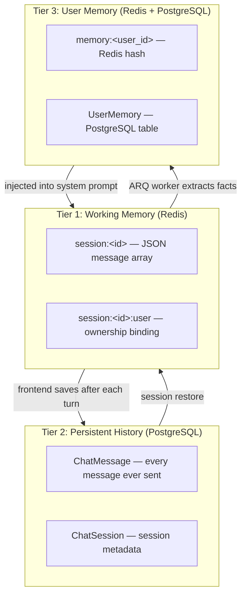
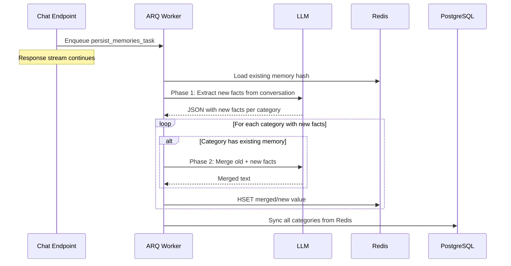

# Memory Architecture

## Three Memory Tiers

The system uses three distinct storage layers for conversation state, each optimized for a different access pattern:



### Tier 1: Working Memory (Redis)

Active conversation state stored in Redis with a 24-hour TTL.

| Key | Value | Purpose |
|-----|-------|---------|
| `session:<id>` | JSON array of messages | Full conversation including system prompt, user messages, assistant responses, and tool results |
| `session:<id>:user` | User ID string | Ownership binding — every endpoint checks this before granting access |
| `session:<id>:agent` | Agent name string | Currently selected agent (project chat only) |

Messages are read and written on every chat turn. Redis provides the sub-millisecond latency needed during the streaming loop where each step reads the full history, calls the LLM, and writes back.

### Tier 2: Persistent History (PostgreSQL)

After each streaming turn completes, both the user message and assistant response are saved to PostgreSQL via SQLAlchemy. This is the durable record — if a Redis session expires, the conversation can be restored.

The `ChatMessage` model includes a `metadata` JSON column for client-side state like quiz answers and agent attribution. The `ChatSession` model links to a `backendSessionId` (the Redis key) and optionally to a `projectId`.

### Tier 3: User Memory

Long-term facts about the user, persisted across sessions to personalize future conversations. Stored in four categories:

| Category | Purpose |
|----------|---------|
| `work_context` | Job role, team, projects, technical context |
| `personal_context` | Personal preferences, background |
| `top_of_mind` | Current focus areas, active concerns |
| `preferences` | Communication style, output format preferences |

User memory lives in two places simultaneously:
- **Redis hash** (`memory:<user_id>`) — for low-latency reads during session creation
- **PostgreSQL table** (`UserMemory`) — for durability across Redis restarts

Both are kept in sync: the ARQ worker writes to Redis first, then syncs to PostgreSQL. Manual edits via the `PUT /chat/memory` endpoint update both stores.

## Memory Extraction Pipeline

After each chat turn, user memories are extracted and persisted asynchronously to avoid blocking the response stream.



### Phase 1: Extraction

The full conversation (user + assistant messages only) is sent to the LLM with the `MEMORY` prompt. The LLM returns a JSON object with new facts organized by category. Only genuinely new information is extracted — the prompt instructs the LLM to skip anything already known.

### Phase 2: Merge

For categories that already have stored memory, the existing text and new facts are sent to the LLM with the `MEMORY_COMPARISON` prompt. The LLM produces a merged version that:
- Keeps existing facts that are still relevant
- Adds new facts
- Removes outdated or contradicted information
- Maintains concise formatting

For categories with no prior memory, the new facts are stored directly.

## System Prompt Injection

When a session is created (`api/session.py`), user memory is loaded from Redis and appended to the system prompt:

```
[Base orchestrator/project prompt]

Known facts about the user:
Work Context
[stored work context]

Preferences
[stored preferences]
...
```

This gives the LLM persistent context about the user without requiring explicit recall. The injection happens at session creation time — if memory is updated mid-conversation, the current session won't reflect the changes until the next session.

## Manual Memory Management

Users can view and edit their memory directly via the API:

- `GET /chat/memory` — returns all four categories from PostgreSQL
- `PUT /chat/memory` — updates a single category in both Redis and PostgreSQL

The frontend exposes this through a settings page where users can review and correct what the system has learned about them.
