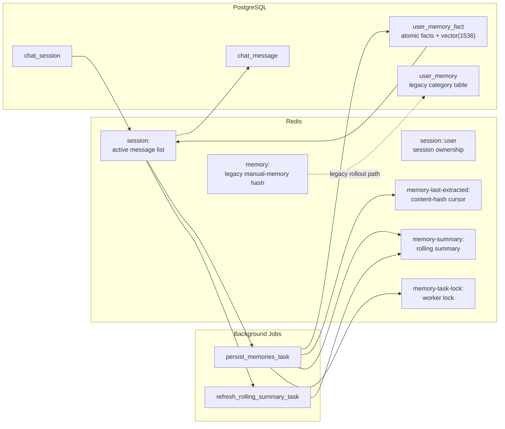
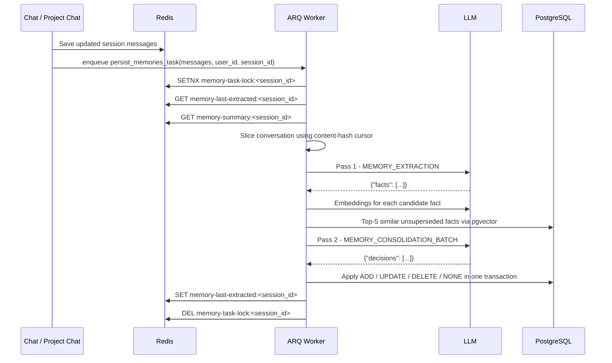

# Memory Architecture

## Overview

The memory system now treats long-term memory as a set of **atomic facts** rather than four coarse text blobs.

There are still three distinct layers of state:

1. **Working conversation state in Redis** for the active session.
2. **Durable chat history in PostgreSQL** for every saved session/message.
3. **Long-term user memory in PostgreSQL** as vector-indexed atomic facts, with Redis used only for extraction cursors, rolling summaries, and worker locks.



## Data Model

### Active Session State

Redis keeps the current conversation for low-latency chat turns.

| Key | Purpose |
|-----|---------|
| `session:<id>` | Current message array for the live session |
| `session:<id>:user` | Session ownership binding |
| `session:<id>:agent` | Optional project-chat agent tracking |

### Durable Chat History

PostgreSQL stores the full chat log:

- `chat_session` holds session metadata.
- `chat_message` holds every persisted message.

This is the restore source if the Redis session expires.

### Long-Term User Memory

The source of truth for user memory is `user_memory_fact`.

Each row is one atomic fact with audit-friendly supersession fields:

| Column | Purpose |
|--------|---------|
| `id` | Fact identifier |
| `user_id` | Owning user |
| `text` | Atomic fact sentence |
| `embedding` | `vector(1536)` embedding for semantic lookup |
| `observed_at` | When the fact was observed |
| `superseded_at` | When the fact stopped being current |
| `superseded_by` | Replacement fact id for updates |
| `source_session_id` | Session or backfill source |

Facts are **never overwritten in place**. When a fact changes, the old row is superseded and a new row is inserted.

## End-to-End Memory Flow

### 1. A chat turn finishes

At the end of a chat turn:

- The assistant response is appended to the Redis session.
- The message list is saved back to Redis.
- A background memory persistence job is enqueued with `schedule_memory_persistence(...)`.

If the conversation is summarized first:

- The session message list is collapsed with `summarize_messages(...)`.
- `memory-last-extracted:<session_id>` is deleted.
- A rolling-summary refresh job is enqueued.

That same summary refresh is also triggered when a session ends.

### 2. The worker decides what is new

`persist_memories_task(...)` uses a **content-hash cursor**, not a message index.

The cursor is:

- `sha256(f"{role}:{content}")`
- stored at `memory-last-extracted:<session_id>`

Worker logic:

1. Acquire `memory-task-lock:<session_id>` with a 5-minute TTL.
2. Load the cursor.
3. Slice the conversation:
   - No cursor: process the full conversation.
   - Cursor found: process only messages after that message.
   - Cursor missing from the current conversation: summarization probably collapsed it, so process the full current conversation.
4. Load `memory-summary:<session_id>` if present.
5. Call `extract_and_persist_memories(...)`.
6. Advance the cursor to the last processed message hash.
7. Periodically refresh the rolling summary every 10 user turns.

This prevents silently skipping content after summarization and avoids reprocessing the whole session on every turn.



## The Two LLM Passes

### Pass 1: Extraction

`MEMORY_EXTRACTION` receives:

- `Observation Date`
- optional rolling summary
- the current conversation slice

The extractor sees both user and assistant turns, but assistant turns are only context. It is instructed to extract only facts the user explicitly stated or confirmed.

The output is:

```json
{"facts": ["Builds AgenticRag with FastAPI", "Prefers concise explanations"]}
```

The extractor is optimized for durable facts like:

- identity
- location
- occupation
- tech stack
- hardware/environment
- long-running projects
- learning goals
- code/communication/workflow preferences
- education/background
- languages

### Pass 2: Consolidation

Each candidate fact is embedded with `text-embedding-3-small`.

For each embedding, the worker queries Postgres for the top-5 most similar active facts:

- search space: `user_memory_fact`
- filter: `user_id = ? AND superseded_at IS NULL`
- operator: cosine distance via pgvector

Then `MEMORY_CONSOLIDATION_BATCH` receives the full candidate batch plus the similar-fact neighborhoods and returns one decision per candidate:

| Action | Meaning |
|--------|---------|
| `ADD` | Insert a genuinely new fact |
| `UPDATE` | Supersede an old fact and insert a replacement |
| `DELETE` | Supersede an old fact with no replacement row |
| `NONE` | Ignore as duplicate/already covered |

All writes happen in one database transaction.

## Persistence Rules

### `ADD`

- Insert a new `user_memory_fact` row.

### `UPDATE`

- Insert a new row.
- Mark the old row with `superseded_at = now`.
- Set `superseded_by = <new_fact_id>`.

### `DELETE`

- Mark the target row with `superseded_at = now`.
- No replacement fact is inserted.

### `NONE`

- Do nothing.

## Rolling Summary

The rolling summary is not a memory store. It is **disambiguation context** for extraction.

It exists to help the extractor understand short replies like:

- "yes, that one"
- "I went with it"
- "use the earlier option"

The summary:

- lives in `memory-summary:<session_id>`
- is refreshed every 10 user turns
- is refreshed after summarization collapses the conversation
- is refreshed when the session ends

This keeps extraction grounded even when the live conversation has been compacted.

## Read Path: How Memory Reaches the Model

When a new session is created or restored:

1. `get_user_memory(user_id)` selects all active facts from `user_memory_fact`.
2. Facts are ordered by `observed_at ASC`.
3. Facts are formatted as a bullet list.
4. That block is appended to the system prompt as:

```text
Known facts about the user:
- Builds AgenticRag with FastAPI
- Prefers concise explanations
```

Important behavior:

- Only unsuperseded facts are injected.
- Current sessions do not hot-reload memory mid-turn.
- Updated memory is picked up on the next session build or restore.

## Observability

The pipeline emits dedicated spans via `memory_extraction_span(...)`.

Current phases:

- `extract`
- `embed`
- `consolidate`
- `persist`
- `summary`

This makes it possible to attribute latency and failures to a specific stage instead of treating memory extraction as one opaque background job.

## Legacy Compatibility During Rollout

The old category-based model is still present temporarily:

- Redis hash: `memory:<user_id>`
- Postgres table: `user_memory`

These remain for:

- one-time backfill

They are no longer the source of truth for automatic extraction or the primary memory UI.

## Backfill

`scripts/backfill_memory_from_redis.py` migrates old category blobs into atomic facts.

Per user:

1. Read `memory:<user_id>` from Redis, falling back to `user_memory`.
2. Convert each non-empty category to a pseudo user message.
3. Run the new extraction prompt over that pseudo conversation.
4. Embed each extracted fact.
5. Insert rows into `user_memory_fact` with:
   - `source_session_id = "backfill-from-redis"`
   - `observed_at = now - 30 days`

The script is idempotent: if a user already has a backfill row, it skips them.

## Memory UI

The memory panel now operates on atomic facts directly.

- `GET /chat/memory` returns active facts from `user_memory_fact`
- `POST /chat/memory` adds one manual atomic fact
- `DELETE /chat/memory/{fact_id}` supersedes one active fact

Manual entries are stored in the same table as extracted memory with:

- `source_session_id = "manual-memory"`

So the UI is no longer tied to the old four categories. It shows one list of active facts and lets the user add or remove individual items.

## Operational Notes

- pgvector is enabled inside PostgreSQL, not as a separate database.
- The migration path creates `user_memory_fact` and leaves `user_memory` intact for the rollout window.
- The dedicated `migrate` service runs Alembic once before `api` and `worker` start, which avoids migration races during startup.

## Current Limitations

- `get_user_memory(...)` currently injects all active facts; there is no top-k retrieval at prompt-build time yet.
- Legacy cleanup is still pending:
  - drop `user_memory`
  - remove `memory:<user_id>` compatibility paths
  - remove deprecated shims after the rollout window
