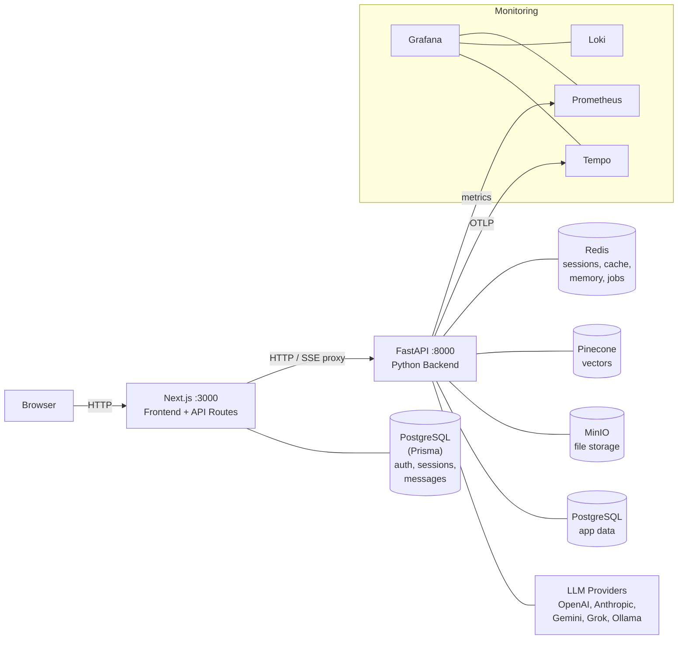
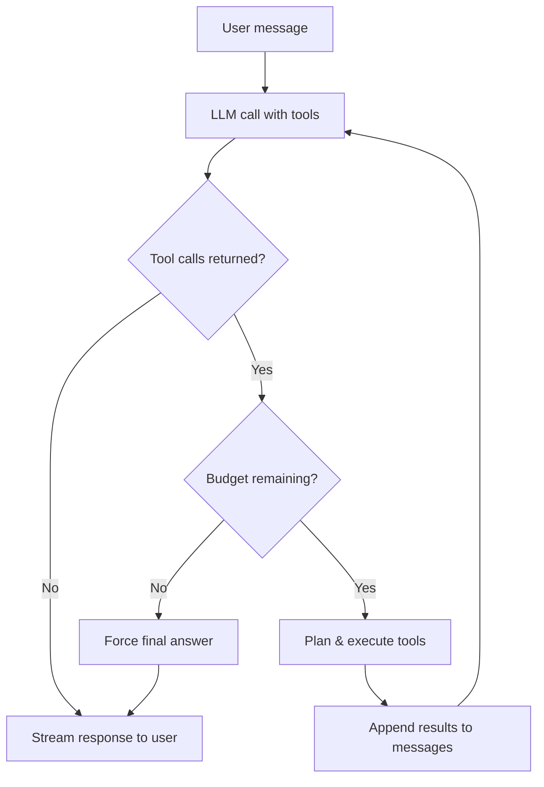
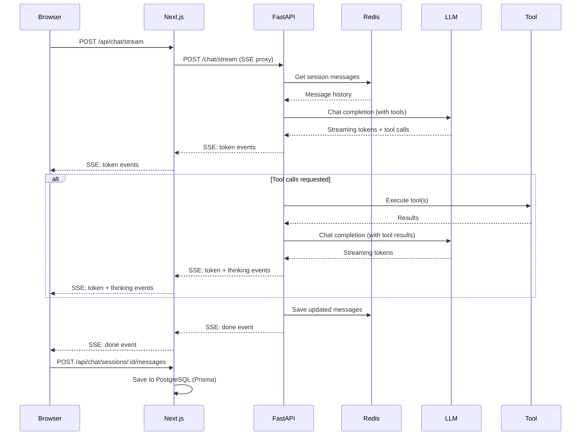

# System Overview

## Architecture

AgenticRAG runs as two servers behind a browser:



## Why Two Servers?

The frontend and backend are separate processes for three reasons:

1. **Language ecosystems.** The RAG pipeline, agent orchestration, and tool execution depend on Python libraries (PyMuPDF, FAISS, Pinecone, LiteLLM, Crawl4AI). The frontend uses Next.js with React Server Components. Running both in one process isn't practical.

2. **Auth cookie isolation.** Next.js API routes handle the browser cookie layer (via Prisma/PostgreSQL) and proxy authenticated requests to FastAPI. The Python backend receives a trusted user ID — it never touches cookies or OAuth flows directly.

3. **Independent scaling.** The API and ingestion worker can scale separately from the frontend. The worker (`arq`) processes document ingestion jobs off a Redis queue without blocking the API server.

## Two PostgreSQL Instances

The system uses two separate PostgreSQL databases:

| Database | Managed by | Stores | Why separate |
|----------|-----------|--------|--------------|
| **Auth DB** | Prisma (Next.js) | Users, accounts, sessions, chat messages, projects, documents | Schema controlled by Prisma migrations. Holds all user-facing data. |
| **App DB** | Alembic (Python) | Application tables queried by the SQL tool | Isolated so LLM-generated SQL queries from the `query_db` tool can never touch auth tables. The SQL tool connects via a read-only user. |

The isolation is a security boundary: the general chat's database query tool runs arbitrary LLM-generated SQL against the app database. Keeping auth data in a separate database ensures a prompt injection attack through the SQL tool cannot access passwords, sessions, or OAuth tokens.

## Redis Roles

A single Redis instance serves five distinct purposes:

| Role | Key pattern | TTL | Description |
|------|-------------|-----|-------------|
| **Session store** | `session:<id>` | 24h | Conversation message history for active chat sessions. Each session holds a JSON array of messages. |
| **Session ownership** | `session:<id>:user` | 24h | Binds each session to a user ID. Every endpoint verifies ownership before access. |
| **User memory** | `memory:<user_id>` | None | Hash of long-term memory categories (`work_context`, `personal_context`, `top_of_mind`, `preferences`). Injected into system prompts. |
| **Semantic cache** | `cache:*` | Varies | Caches tool results (web search, KB queries) to avoid redundant LLM/API calls. |
| **Job queue** | ARQ internals | — | ARQ worker picks up document ingestion jobs from Redis. |

Why Redis for all five? Each role needs low-latency reads during the chat loop. Using separate stores would add connection overhead per request. The roles have naturally different TTLs and key patterns, so they don't conflict.

## Chat Modes

The application has two distinct chat paths:

### General Chat

The user talks to an orchestrator that has access to tools (web search, database queries, browser, knowledge base). The orchestrator runs a multi-step reasoning loop:



Budget constraints prevent runaway loops:
- **3** max reasoning steps
- **6** max total tool calls
- **3** max parallel calls per step

When budget is exhausted, the orchestrator is forced to produce a final answer from gathered evidence.

### Project Chat

The user uploads documents to a project, then chats with them. Instead of tools, this mode uses:

1. **Agent routing** — an LLM classifier picks a specialized agent (reasoning, summary, quiz, visualization) based on intent
2. **Adaptive retrieval** — the query is embedded and matched against the project's Pinecone index using a strategy tuned to corpus size
3. **Context injection** — retrieved chunks are inserted into the agent's system prompt
4. **Streaming response** — the agent generates a response grounded in the retrieved context

See [Chat Modes](chat-modes.md) for the full orchestration details.

## End-to-End Data Flow

Here's what happens when a user sends a message in general chat:



Key details:
- Next.js API routes **proxy** the SSE stream — the browser never talks to FastAPI directly
- Messages are saved to Redis (working memory) during the chat turn, then to PostgreSQL (persistent history) by the frontend after the stream completes
- User memory is extracted asynchronously via an ARQ worker after each turn
- The frontend generates local IDs during streaming, then replaces them with database IDs after the POST returns

## Service Topology

All services are defined in `compose.yml` with health checks and dependency ordering:

```
postgres (healthy) ─┐
redis (healthy) ────┤
minio (healthy) ────┤
                    ├── minio-setup (completed) ─── api ─── frontend
                    │                            └── worker
                    │
prometheus ─────────┤
loki ── promtail    ├── grafana
tempo ──────────────┘
```

The API and worker both run Alembic migrations on startup (`uv run alembic upgrade head`), so the first container to start handles schema creation.
