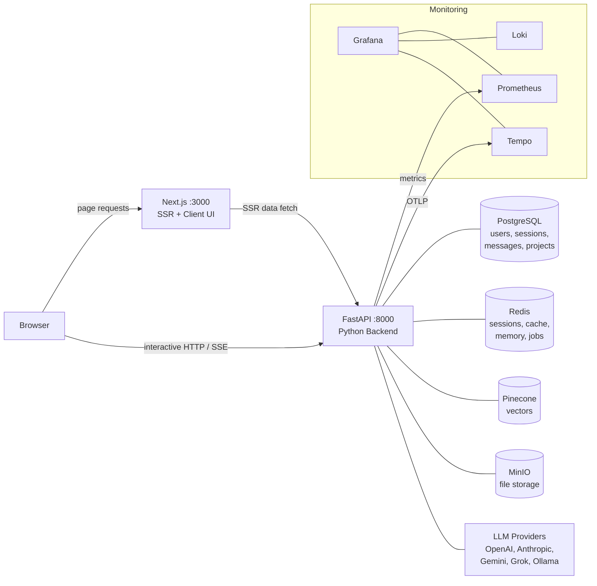
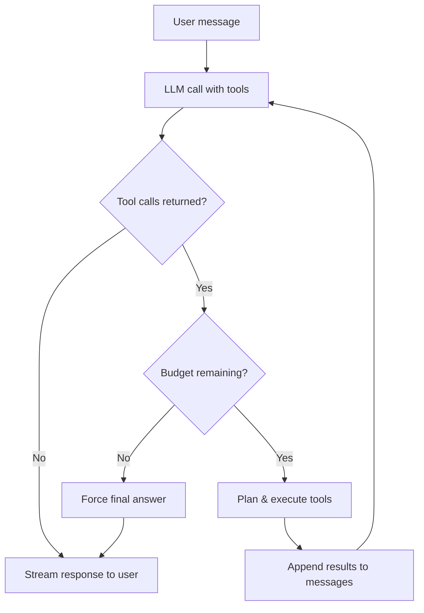
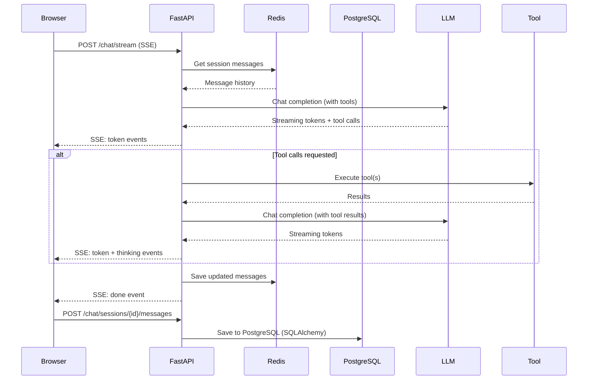

# System Overview

## Related Docs

- [Chat Modes](chat-modes.md) — orchestration loop vs project chat flow
- [LLM Layer](llm-layer.md) — provider abstraction, model selection, response normalization
- [Memory](memory.md) — session state, atomic memory extraction, rolling summaries
- [Observability](observability.md) — tracing, metrics, logs, dashboards

## Architecture

RunaxAI uses a hybrid Next.js frontend and a FastAPI backend. The browser still talks directly to FastAPI for interactive API calls and SSE streams, but protected route loads now fetch their initial data on the Next.js server before hydrating into client components.



## Frontend–Backend Communication

There are two active communication paths:

1. **Browser-side interactive calls** go directly to FastAPI. The `apiFetch()` function in `lib/api.ts` strips the `/api` prefix from paths and sends requests to the backend URL (`NEXT_PUBLIC_API_URL`).
2. **Protected route SSR loads** use `frontend/lib/server-api.ts`, which forwards the incoming auth cookie from Next.js to FastAPI so `/chat` and `/projects/[id]` can render with initial data on the server.

Browser-side examples:

```
Frontend: apiFetch("/api/chat/stream", ...) → FastAPI: POST /chat/stream
Frontend: apiFetch("/auth/login", ...)      → FastAPI: POST /auth/login
```

SSR examples:

```
Next.js server: fetch /chat/sessions      → FastAPI: GET /chat/sessions
Next.js server: fetch /projects/{id}      → FastAPI: GET /projects/{id}
Next.js server: fetch /projects/{id}/sessions → FastAPI: GET /projects/{id}/sessions
```

Auth cookies (`httponly`, `samesite=lax`) are sent via `credentials: "include"` on browser requests and explicitly forwarded on SSR fetches. SSE streams are still read directly from the FastAPI response in the browser.

## Why Two Processes?

1. **Language ecosystems.** The RAG pipeline, agent orchestration, and tool execution depend on Python libraries (PyMuPDF, FAISS, Pinecone, LiteLLM, Crawl4AI). The frontend uses Next.js with React. Running both in one process isn't practical.

2. **Independent scaling.** The API and ingestion worker can scale separately from the frontend. The worker (`arq`) processes document ingestion jobs off a Redis queue without blocking the API server.

3. **Separation of concerns.** The frontend handles page rendering, SSR hydration, and interactive UI state. Auth, persistence, orchestration, retrieval, and tool execution still live in Python.

## PostgreSQL

A single PostgreSQL instance stores everything, managed by SQLAlchemy + Alembic:

- **Users & auth** — `User`, `OAuthAccount` tables (FastAPI-Users)
- **Chat data** — `ChatSession`, `ChatMessage` tables
- **Projects** — `Project`, `Document` tables
- **User memory** — `UserMemoryFact` for atomic long-term memory, plus `UserMemory` as a temporary legacy compatibility table during rollout

The `query_db` tool (general chat) connects to this same database through a **read-only user** created by `database/setup-reader.sh`. This prevents LLM-generated SQL from modifying data, but it is not a hard domain-isolation boundary because the reader currently has `SELECT` access across the `public` schema.

## Redis Roles

A single Redis instance serves several distinct purposes:

| Role | Key pattern | TTL | Description |
|------|-------------|-----|-------------|
| **Session store** | `session:<id>` | 24h | Conversation message history for active chat sessions. Each session holds a JSON array of messages. |
| **Session ownership** | `session:<id>:user` | 24h | Binds each session to a user ID. Every endpoint verifies ownership before access. |
| **Memory cursor** | `memory-last-extracted:<session_id>` | 30d | Content-hash cursor for incremental memory extraction. |
| **Rolling summary** | `memory-summary:<session_id>` | 30d | Compact conversation summary used as extraction context. |
| **Memory worker lock** | `memory-task-lock:<session_id>` | 5m | Prevents concurrent extraction for the same session. |
| **Legacy memory backfill** | `memory:<user_id>` | None | Old category-based memory hash, kept temporarily for backfill and rollout cleanup. |
| **Semantic cache** | `cache:*` | Varies | Caches tool results (web search, KB queries) to avoid redundant LLM/API calls. |
| **Job queue** | ARQ internals | — | ARQ worker picks up document ingestion jobs from Redis. |

Why Redis for all of them? Each role needs low-latency reads during the chat loop. Using separate stores would add connection overhead per request. The roles have naturally different TTLs and key patterns, so they don't conflict.

## Chat Modes

The application has two distinct chat paths:

### General Chat

The user talks to an orchestrator that has access to tools (web search, database queries, browser, knowledge base). The orchestrator runs a multi-step reasoning loop:



Budget constraints prevent runaway loops:
- **3** max reasoning steps
- **6** max total tool calls
- **3** max parallel calls per step

When budget is exhausted, the orchestrator is forced to produce a final answer from gathered evidence.

### Project Chat

The user uploads documents to a project, then chats with them. Instead of tools, this mode uses:

1. **Agent routing** — an LLM classifier picks a specialized agent (reasoning, summary, quiz, visualization) based on intent
2. **Adaptive retrieval** — the query is embedded and matched against the project's Pinecone index using a strategy tuned to corpus size
3. **Context injection** — retrieved chunks are inserted into the agent's system prompt
4. **Streaming response** — the agent generates a response grounded in the retrieved context

See [Chat Modes](chat-modes.md) for the full orchestration details.

## Related Architecture Guides

Use the subsystem guides for implementation details that do not belong in this overview:

- [Chat Modes](chat-modes.md) for orchestration details, tool budgets, and project-agent routing
- [LLM Layer](llm-layer.md) for provider setup, streaming behavior, and model abstraction
- [Memory](memory.md) for the atomic memory pipeline, Redis cursor keys, and `user_memory_fact`
- [Observability](observability.md) for tracing spans, Prometheus metrics, and Grafana/Tempo/Loki setup

## End-to-End Data Flow

Here's what happens when a user sends a message in general chat:



Key details:
- Browser-side API calls and SSE still talk directly to FastAPI
- Protected route loads use Next.js server-side fetches before the page hydrates
- Messages are saved to Redis (working memory) during the chat turn, then to PostgreSQL (persistent history) after the stream completes
- User memory is extracted asynchronously via an ARQ worker after each turn into `user_memory_fact`
- The frontend generates local IDs during streaming, then replaces them with database IDs after the POST returns

## Service Topology

All services are defined in `compose.yml` with health checks and dependency ordering:

```
postgres (healthy) ─┐
redis (healthy) ────┤
minio (healthy) ────┤
                    ├── minio-setup (completed) ─── migrate (completed) ─── api ─── frontend
                    │                                                     └── worker
                    │
prometheus ─────────┤
loki ── promtail    ├── grafana
tempo ──────────────┘
```

A dedicated `migrate` service now runs Alembic exactly once before `api` and `worker` start. This avoids concurrent migration races during startup.
