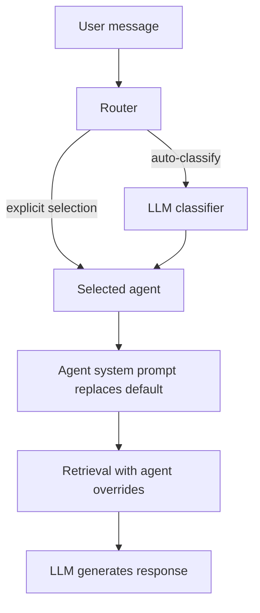

# Agent System

Agents are specialized response generators for project chat. Each agent has its own system prompt and optional retrieval overrides, producing different types of output from the same document context.

## Architecture



### Agent Definition

Agents are defined as `Agent` dataclass instances in `agents/base.py`:

```python
from dataclasses import dataclass, field

@dataclass
class Agent:
    name: str                          # Unique identifier
    description: str                   # Shown to user in UI
    system_prompt: str                 # Replaces the session system prompt

    top_k_override: int | None = None  # Override retrieval top_k
    alpha_override: float | None = None # Override hybrid search alpha

    structured_output: bool = False    # Output parsed as JSON
    output_schema: str = ""            # JSON schema hint in prompt
    context_instructions: str = ""     # Extra instructions with context
    tool_names: list[str] = field(default_factory=list) # Scoped project-chat tools
```

### Registry

`agents/registry.py` auto-discovers agents at import time:

1. Scans `agents/` for Python modules (skips `base`, `registry`, `router`)
2. Imports each module and looks for a module-level `agent` variable
3. If it's an `Agent` instance, registers it by `agent.name`

No manual registration needed — drop a file in `agents/` with an `agent` variable and restart.

### Router

`agents/router.py` handles agent selection via two modes:

**Explicit** — the frontend passes an `agent_name`. If it's a known agent (and not `"auto"`), it's used directly.

**Auto-classify** — the full conversation (user + assistant messages, truncated to 300 chars each) is sent to the LLM with a classification prompt. The LLM responds with a single word (the agent name). Configuration:
- `max_completion_tokens=10` — forces a one-word response
- `temperature=0` — deterministic classification
- Falls back to `"reasoning"` on unknown response or error

The classifier is context-aware: if the user says "one more" or "again", it sees the conversation history and keeps the same agent.

## Built-in Agents

| Agent | Purpose | Structured? | Retrieval overrides |
|-------|---------|------------|-------------------|
| **reasoning** | Deep analysis, Q&A, comparisons, concept explanation | No | None (adaptive defaults) |
| **summary** | Document overviews, key takeaways | No | None |
| **quiz** | Interactive quizzes, test questions | Yes (JSON) | None |
| **visualization** | Charts, mermaid diagrams, data tables | Yes (JSON) | None |

All built-in agents currently leave `tool_names` empty, so they answer from retrieved project context without external tool calls.

### Structured Output Agents

Quiz and visualization agents set `structured_output=True` and include an `output_schema` in their system prompt that describes the expected JSON format.

The frontend's `MessageBubble` component runs `tryParseQuiz()` and `tryParseChart()` on all assistant messages to detect structured content, regardless of which agent produced it.

## Adding a New Agent

Create `agents/my_agent.py`:

```python
from agents.base import Agent

agent = Agent(
    name="my_agent",
    description="One-line description shown in the UI",
    system_prompt="""You are a specialized assistant that...

Your task is to...
""",
    # Optional: override retrieval parameters
    top_k_override=15,
    alpha_override=0.8,

    # Optional: structured JSON output
    structured_output=False,
    output_schema="",

    # Optional: extra instructions appended to retrieved context
    context_instructions="Focus on...",

    # Optional: expose only these registered tools during project chat
    tool_names=["search"],
)
```

The agent is auto-discovered on restart. To make it available in the auto-router, add its name and description to the `CLASSIFICATION_PROMPT` in `agents/router.py`.

If the agent produces structured output, add a parser in the frontend (`tryParseFoo()` pattern in `MessageBubble.tsx`) and a renderer component.
