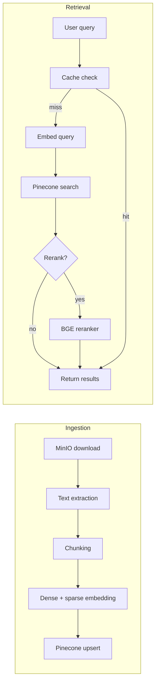

# RAG Pipeline

## Overview

The pipeline handles two paths: **ingestion** (document to vectors) and **retrieval** (query to relevant chunks).

Each ingestion step is wrapped in an OpenTelemetry span for tracing.

## Ingestion

Entry point: `pipeline/ingestion.py` → `ingest_document()`

### 1. Download

The document is downloaded from MinIO to a temporary file using the object key (`project_id/document_id.ext`). The temp file is cleaned up after processing.

### 2. Text Extraction

`pipeline/extractor.py` handles format-specific extraction:

| Format | Library | Output |
|--------|---------|--------|
| PDF | PyMuPDF (`pymupdf4llm`) | One page dict per PDF page with page numbers |
| DOCX | python-docx | Single page dict with full text |
| CSV | Built-in | Row groups as separate page dicts with column headers |
| MD, TXT | Built-in | Single page dict with file contents |

Each page dict has `{"text": str, "page_number": int|None, "source": str}`.

### 3. Chunking

`pipeline/chunker.py` splits pages into chunks sized for embedding (~2000 characters, ~400-500 tokens).

#### Strategy Selection

The chunker auto-selects a strategy based on content characteristics:

| Strategy | Trigger | How it works |
|----------|---------|-------------|
| **recursive** | Default | Splits text using a hierarchy of separators (`\n\n\n` → `\n\n` → `\n` → `. ` → word → character). Tries the coarsest separator first, falls back to finer ones for oversized pieces. |
| **semantic** | 3+ markdown headers in text > 2000 chars | Splits on markdown headers (`# `, `## `, etc.), keeping sections together. Oversized sections are recursively split. |
| **row_based** | CSV data (pages contain `Columns:`) | Uses the extractor's row groups directly. |

#### Text Cleaning

Before chunking, text goes through normalization:
- Collapse runs of 3+ newlines into 2
- Collapse whitespace into single spaces
- Strip leading/trailing whitespace per line
- Remove standalone page number artifacts (common in PDFs)
- Remove repeated header/footer lines (exact duplicates appearing 3+ times)

#### Sentence-Boundary Overlap

Chunks overlap by ~300 characters to prevent context loss at boundaries. The overlap is sentence-boundary-aware: it scans backward for sentence-ending punctuation (`. `, `! `, `? `) followed by an uppercase letter, or falls back to newline boundaries. This avoids splitting mid-sentence at overlap points.

Chunks smaller than 20 characters after filtering are discarded.

### 4. Embedding

`pipeline/embedder.py` generates two types of embeddings for hybrid search:

| Type | Model | Dimensions | Purpose |
|------|-------|-----------|---------|
| **Dense** | `text-embedding-3-large` | 3072 | Semantic similarity |
| **Sparse** | `pinecone-sparse-english-v0` | Variable | Exact keyword matching (BM25-style) |

Both are batched at 96 texts per API call (Pinecone sparse model limit).

Why two embeddings? Dense vectors capture semantic meaning ("What is the revenue?" matches "total income"), but miss exact keyword matches that matter for technical content. Sparse vectors handle keywords well but miss paraphrasing. Hybrid search combines both.

### 5. Vector Metadata

Each vector is stored with metadata for filtering and display:

| Field | Value | Max size |
|-------|-------|----------|
| `text` | Chunk text | 8KB (Pinecone allows 40KB) |
| `source` | Original filename | — |
| `chunk_index` | Position in document | — |
| `start_index` | Character offset in source | — |
| `document_id` | Document ID | — |
| `project_id` | Project ID | — |
| `page` | PDF page number (optional) | — |

### 6. Upsert

Vectors are upserted to Pinecone under the project's namespace. The index is automatically created on first use if it doesn't exist.

## Retrieval

Entry point: `pipeline/retriever.py` → `retrieve()`

### Adaptive Retrieval

The retrieval strategy adapts based on corpus size (total chunks in the project):

| Corpus size | Mode | Alpha | Top K | Rerank | Why |
|-------------|------|-------|-------|--------|-----|
| < 500 chunks | Dense only | 1.0 | 5 | No | Small corpora don't benefit from sparse vectors — semantic search is sufficient |
| 500 - 10K | Hybrid | 0.7 | 10 | No | BM25 helps catch exact keyword matches that dense search misses |
| > 10K | Hybrid + rerank | 0.5 | 20 → 10 | Yes | Large corpora need reranking to filter noise from the expanded candidate set |

**Alpha** controls the dense/sparse weighting: `1.0` = pure dense, `0.0` = pure sparse, `0.7` = 70% dense + 30% sparse.

Agents can override `top_k` and `alpha` via their agent definition (e.g., the quiz agent might request more chunks for comprehensive coverage).

### Reranking

When enabled (corpora > 10K chunks), the retriever:
1. Fetches 20 candidates from Pinecone
2. Sends them to Pinecone's `bge-reranker-v2-m3` model
3. Returns the top 10 re-scored results

If the reranker fails (API error, timeout), results fall back to score-based ordering.

### Retrieval Cache

`pipeline/retrieval_cache.py` provides a Redis-backed cache keyed on `(project_id, query)`. Identical queries against the same project return cached results without hitting Pinecone. The cache is checked before embedding the query.

## File Formats

Supported upload formats:
- **PDF** — full text extraction with page numbers preserved
- **DOCX** — paragraph text extraction
- **CSV** — row-grouped extraction with column headers
- **MD** — raw markdown text
- **TXT** — raw text
