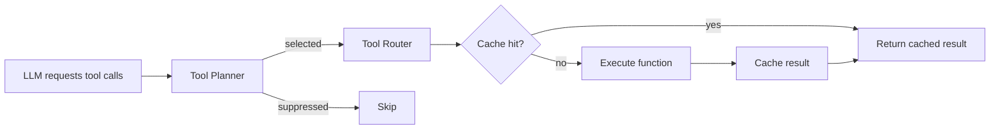

# Tool System

Tools are autonomous capabilities available to the general chat orchestrator. The LLM decides when and how to use them based on the user's query.

## Architecture



## Auto-Discovery

`functions/__init__.py` scans the `functions/` package at import time:

1. Iterates over all Python modules (skips `_`-prefixed and `tool_router`, `compare_kb`)
2. Looks for a `SCHEMA` dict (OpenAI function calling format)
3. Finds the function matching `schema["function"]["name"]`
4. Registers the function, schema, and optional `CACHEABLE` flag and `POLICY` dict

No manual registration — add a module with `SCHEMA` and a matching function.

## Built-in Tools

| Tool | Description | Cacheable | Execution mode |
|------|-------------|-----------|---------------|
| `search` | Web search via Brave Search API + LLM summarization | Yes | parallel_safe |
| `query_db` | Natural language → SQL → PostgreSQL (read-only user) | No | sequential |
| `browser_task` | Headless browser for interactive web pages | No | sequential |
| `crawl_website` | Extract and read web page content via Crawl4AI | No | sequential |
| `query_local_kb` | Search local FAISS knowledge base | Yes | parallel_safe |
| `portfolio` | Portfolio-specific queries | Yes | parallel_safe |

## Tool Schema Format

Each tool exports an OpenAI function calling schema:

```python
SCHEMA = {
    "type": "function",
    "function": {
        "name": "my_tool",
        "description": "What this tool does and when to use it",
        "parameters": {
            "type": "object",
            "properties": {
                "query": {
                    "type": "string",
                    "description": "The search query",
                },
            },
            "required": ["query"],
        },
    },
}
```

## Tool Policies

Policies control how the tool planner handles each tool. Set a `POLICY` dict in the tool module:

```python
POLICY = {
    "execution_mode": "parallel_safe",    # or "sequential_first"
    "max_parallel_instances": 3,          # max concurrent calls
    "requires_fresh_input": False,        # needs prior tool results?
    "dedupe_key_fields": ("query",),      # fields for fingerprinting
    "verification_only_after_result": False,
}
```

| Field | Default | Description |
|-------|---------|-------------|
| `execution_mode` | `sequential_first` | `parallel_safe` allows concurrent execution with other parallel-safe tools. `sequential_first` runs alone. |
| `max_parallel_instances` | 1 | Maximum concurrent calls of this tool per step |
| `requires_fresh_input` | `True` | If `True`, requires new tool evidence since last call before running in parallel |
| `dedupe_key_fields` | `()` | Which argument fields are used for fingerprinting (empty = all args) |

## Tool Planner

The planner (`utils/tool_planner.py`) sits between the LLM's requested tool calls and execution:

### Fingerprinting

Each tool call is fingerprinted as `SHA-256(tool_name + dedupe_key_fields)`. This creates a stable identifier for "the same call" regardless of argument ordering.

### Duplicate Suppression

Two types of duplicates are suppressed:

1. **In-batch duplicates** — the LLM requests the same call twice in one response
2. **Cross-step duplicates** — the same fingerprint was executed in a previous step, and no new tool evidence has arrived since

The `current_evidence_version` counter increments after each tool result. If a fingerprint's `last_evidence_version` matches the current version, it means no new information has arrived since that tool last ran, so repeating it is pointless.

### Parallel vs Sequential

The planner checks if all candidates in a batch are `parallel_safe` with `requires_fresh_input=False`. If so, they run concurrently (up to `max_parallel_calls_per_step`). Otherwise, only the first candidate runs.

## Tool Router

`functions/tool_router.py` dispatches tool calls:

1. Parse arguments from the tool call JSON
2. Check if the tool is registered
3. For cacheable tools with a `query` argument, check the semantic cache
4. Execute the function
5. Cache the result if cacheable
6. Return a `{"role": "tool", "tool_call_id": ..., "content": ...}` message

Each execution is wrapped in an OpenTelemetry span and emits Prometheus metrics (duration, status, cache behavior).

## Caching

Tools marked with `CACHEABLE = True` use a Redis semantic cache (`memory/cache.py`). The cache is keyed on `(tool_name, query)` and checks for semantically similar queries before executing. This avoids redundant API calls (e.g., searching the web for the same query twice across sessions).

## Adding a New Tool

Create `functions/my_tool.py`:

```python
SCHEMA = {
    "type": "function",
    "function": {
        "name": "my_tool",
        "description": "Describe what this tool does and when the LLM should use it",
        "parameters": {
            "type": "object",
            "properties": {
                "query": {
                    "type": "string",
                    "description": "Parameter description",
                },
            },
            "required": ["query"],
        },
    },
}

# Optional: enable result caching
CACHEABLE = True

# Optional: execution policy
POLICY = {
    "execution_mode": "parallel_safe",
    "max_parallel_instances": 3,
    "requires_fresh_input": False,
    "dedupe_key_fields": ("query",),
}


def my_tool(query: str) -> dict:
    """Function name must match SCHEMA function name."""
    # ... implementation ...
    return {"result": "..."}
```

The tool is auto-discovered on restart and immediately available to the orchestrator.
