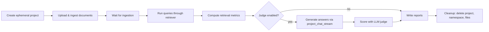

# Evaluation

## Test Suite

The project uses pytest for unit and integration tests. Run:

```bash
uv run pytest
```

### Test Coverage

| Test file | What it covers |
|-----------|---------------|
| `test_chunker.py` | Recursive, semantic, and row-based chunking strategies |
| `test_retrieval_cache.py` | Redis retrieval cache hit/miss/TTL behavior |
| `test_rate_limit.py` | Sliding window algorithm, rule matching, subject extraction |
| `test_session_security.py` | Session ownership verification, cross-user access prevention |
| `test_chat_orchestration.py` | Multi-step reasoning loop, budget enforcement, forced final answer |
| `test_tool_planner.py` | Parallel/sequential planning, fingerprinting, duplicate suppression |
| `test_llm_stream_metrics.py` | TTFT tracking, token counting, cost estimation |
| `test_observability_hash.py` | Stable hashing for identity labels |
| `test_observability_context.py` | ContextVar push/pop, agent name tracking |
| `test_tracing_setup.py` | OTel initialization gating |
| `test_eval_metrics.py` | Retrieval metric implementations (Recall, MRR, NDCG) |
| `test_query_db.py` | SQL query tool safety |
| `test_memory_tasks.py` | Memory extraction and persistence |
| `test_memory_api.py` | Atomic memory API list/add/delete behavior |
| `test_memory_semantic.py` | Semantic memory extraction, consolidation, and pgvector lookup helpers |
| `test_chat_export.py` | Chat session export |
| `test_project_search.py` | Project document search |

## RAG Evaluation Harness

The eval harness (`evals/run_eval.py`) runs end-to-end evaluation of the RAG pipeline: ingestion, retrieval, and optionally answer generation with LLM-as-judge scoring.

### Quick Start

```bash
# Retrieval metrics only (fast, no LLM judge)
uv run python evals/run_eval.py --dataset smoke --skip-judge

# Full evaluation with LLM-as-judge
uv run python evals/run_eval.py --dataset smoke

# Custom judge model
uv run python evals/run_eval.py --dataset smoke --judge-model gpt-4o
```

### Pipeline



The harness creates a real project, ingests real documents, and queries the real pipeline. It cleans up everything after completion — no persistent test data left behind.

### Prerequisites

- Running Docker Compose stack (PostgreSQL, Redis, Pinecone, MinIO)
- Environment variables configured in `.env`
- For judge evaluation: an LLM API key

### Retrieval Metrics

| Metric | What it measures |
|--------|-----------------|
| **Recall@k** | Fraction of expected documents found in top-k results. Answers: "Are the right documents being retrieved?" |
| **MRR** | Reciprocal rank of the first relevant result. Answers: "How quickly does the system find something relevant?" |
| **NDCG@k** | Normalized discounted cumulative gain with binary relevance. Answers: "Are relevant documents ranked higher?" |
| **Substring Recall** | Fraction of expected text substrings found in retrieved chunks. Answers: "Does the retrieved content contain the specific information needed?" Case-insensitive. |

### Answer Quality Metrics (LLM Judge)

When judge evaluation is enabled, the harness generates answers via `project_chat_stream` and scores them on four dimensions (1-5 scale with reasoning):

| Metric | What it measures |
|--------|-----------------|
| **Faithfulness** | Are claims grounded in the retrieved context? |
| **Completeness** | Does the answer cover all expected points? |
| **Hallucination** | Is the answer free of unsupported or incorrect claims? |
| **Format Adherence** | Does the answer match the expected output format? |

### Dataset Format

Create a dataset directory under `evals/datasets/<name>/`:

```
evals/datasets/my_dataset/
├── documents/        # Files to ingest (md, txt, pdf, csv, docx)
│   ├── report.pdf
│   └── notes.md
└── queries.jsonl     # One query per line
```

Each line in `queries.jsonl`:

```json
{
  "id": "q1",
  "query": "What was the revenue in Q3?",
  "expected_doc_filenames": ["report.pdf"],
  "expected_chunk_substrings": ["revenue", "Q3"],
  "expected_answer_traits": ["mentions specific revenue figure"]
}
```

### Reports

Reports are written to `evals/reports/` (gitignored):
- `<run_id>.json` — structured data for programmatic analysis
- `<run_id>.md` — human-readable summary with per-query drill-down

### Configuration

`evals/config.yaml` controls:
- Judge model selection
- k values for Recall@k and NDCG@k
- Ingestion settings (chunk size, overlap)
- Poll intervals for ingestion completion
