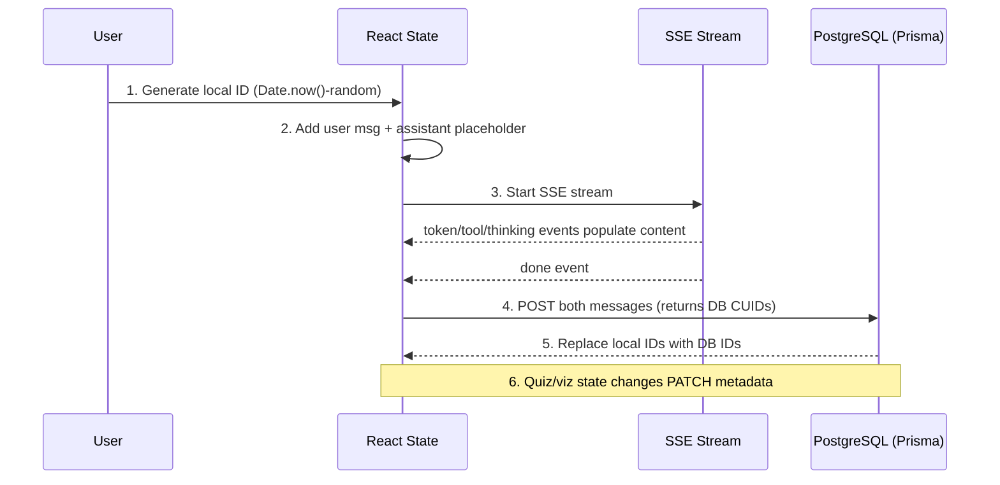

# SSE Streaming & Message Lifecycle

## SSE Parser

Both `streamChat()` and `streamProjectChat()` in `lib/api.ts` use the same SSE parsing approach:

1. POST to the stream endpoint with `credentials: "include"`
2. Read the `ReadableStream` with a `TextDecoder`
3. Buffer incoming chunks and split on `\n\n` (SSE event boundary)
4. Parse each event block for `event:` and `data:` lines
5. Dispatch typed `SSEEvent` objects to the `onEvent` callback

```typescript
export type SSEEvent =
  | {type: "token"; data: string}
  | {type: "tool"; data: {name: string; args?: Record<string, unknown>}}
  | {type: "thinking"; data: {content: string}}
  | {type: "agent"; data: {name: string; description: string}}
  | {type: "retrieval"; data: {sources: RetrievalSource[]; count: number}}
  | {type: "error"; data: string}
  | {type: "done"; data: {tools_used?: string[]; prompt_tokens: number; ...}};
```

### Buffer Management

The parser accumulates chunks in a buffer and splits on double newlines. The last part (which may be an incomplete event) is kept in the buffer for the next read cycle. This handles the case where SSE events are split across TCP packets.

### Abort Support

Both stream functions accept an `AbortSignal`. Aborting cancels the fetch and stops reading the stream. The page component creates an `AbortController` per message and aborts it on component unmount or when the user starts a new message.

## Message Lifecycle

A complete message goes through 6 steps from send to persistence:



### Step by step

1. **Local ID generation** — the frontend creates a temporary ID (`Date.now()-${Math.random()}`) for both the user message and assistant placeholder. This allows React to render immediately without waiting for the database.

2. **Placeholder messages** — the user message is added to state with the local ID. An empty assistant message is created with `status: {type: "running"}`.

3. **SSE streaming** — as events arrive:
   - `token` → content is appended to the assistant message
   - `tool` → a `ToolCall` entry is added to `toolCalls` array with status `"running"`
   - `thinking` → text entries are added to `thinkingEntries` (displayed in ThinkingBlock)
   - `agent` → `agentName` is set on the message
   - `retrieval` → `sources` array is populated
   - `error` → status is set to `{type: "incomplete", reason: "error"}`
   - `done` → status is set to `{type: "complete", reason: "stop"}`

4. **Database save** — once the stream completes, both messages are POSTed to `/api/chat/sessions/{id}/messages`. The endpoint returns the database-generated CUID for each message.

5. **ID replacement** — the local IDs in React state are replaced with the database CUIDs. This is necessary because metadata PATCH operations (step 6) need the real database ID.

6. **Metadata updates** — quiz answers, agent names, and other client state are PATCHed to `/api/chat/messages/{id}` using the database ID. This persists interactive state across page reloads.

## Structured Content Detection

`MessageBubble` checks every assistant message for structured content, regardless of which agent produced it. This handles session restore where `agentName` may be lost.

### Detection Order

1. `tryParseQuiz(content)` — checks if content is valid quiz JSON
2. `tryParseChart(content)` — checks if content is valid chart/mermaid/table JSON

### Three-Stage JSON Fallback

Both parsers use the same extraction strategy:

1. **Raw parse** — try `JSON.parse(content)` directly
2. **Code fence extraction** — look for ` ```json ... ``` ` blocks and parse the inner content
3. **Brace matching** — find the last `{...}` or `[...]` in the string (handles cases where the LLM adds trailing text after the JSON)

If all three stages fail, the content is rendered as regular markdown.

## Message Parts

Messages use a structured `parts` array (`MessagePart[]`) that normalizes different content types:

| Part type | Source | Purpose |
|-----------|--------|---------|
| `text` | Token events | Main response text |
| `reasoning` | Thinking events | Reasoning step text |
| `tool-call` | Tool events | Tool call with name, args, result |
| `source` | Retrieval events | Retrieved document references |
| `data` | Done event | Metadata (tools used, token count) |

Parts are built during streaming and can also be reconstructed from legacy message format (for backward compatibility with older persisted messages).
